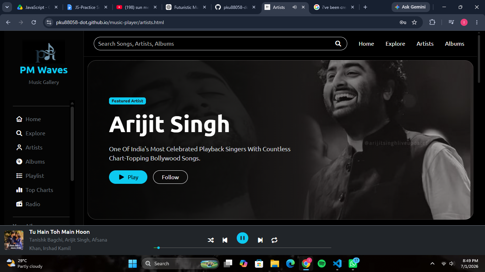

# 🎵 MelodyStream

A sleek, responsive, and modern web-based music player frontend built using vanilla web technologies. This application provides a seamless user interface for discovering, playing, and managing music tracks with responsive layouts and intuitive controls.

## 📱 Live Preview

[]](https://pku88058-dot.github.io/music-player/)

*Click on the image above to open the live interactive application.*

## ✨ Features

*   **Responsive Layout**: Fully optimized for mobile, tablet, and desktop screens using Bootstrap 5.
*   **Core Audio Controls**: Play, pause, skip, rewind, and shuffle capabilities.
*   **Interactive Progress Bar**: Custom seek bar showing current playback time and total track duration.
*   **Volume Customization**: Smooth volume slider with an instant mute/unmute toggle.
*   **Visual Playlist**: Clean UI display of the active track queue and upcoming songs.
*   **Dynamic UI Updates**: Album art rotates during active playback and updates per track.

## 🚀 Tech Stack

*   **Structure**: HTML5
*   **Styling**: CSS3 & Bootstrap 5
*   **Logic**: Vanilla JavaScript (ES6+)
*   **Icons**: [FontAwesome / Bootstrap Icons]

## 📂 Project Structure

```text
├── img/          # Images, album art, and local audio tracks
├── css/             # Custom stylesheets complementing Bootstrap
├── js/              # JavaScript logic (audio APIs, DOM manipulation)
├── html/            #HTML folder
└── README.md        # Project documentation
```

## 🔮 Future Enhancements

*   Integration with a live music API (like Spotify or Shazam).
*   Dynamic dark/light mode toggle.
*   Lyrics synchronization with the active track timeline.
*   Local storage integration to remember the user's last played song.


## 🧑‍💻 Author

*   **Your Name** - [@Its P](https://github.com/pku88058-dot)
*   Project Link: [music-player](https://pku88058-dot.github.io/music-player/)

